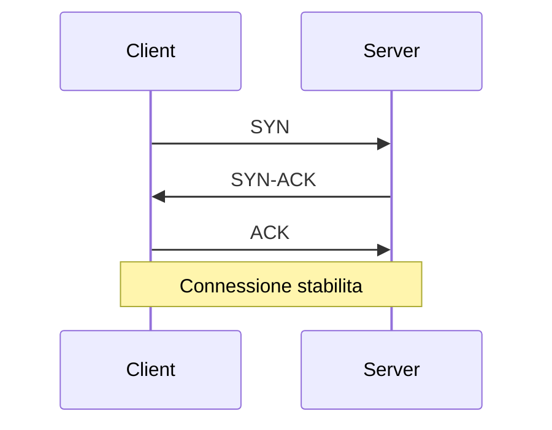

# 1. Concetti Fondamentali del Networking

## Introduzione
Il networking è la spina dorsale delle applicazioni moderne. Comprendere i concetti fondamentali è essenziale per sviluppare applicazioni robuste e scalabili che comunicano efficacemente attraverso la rete.

## Teoria

### Il Modello OSI e TCP/IP

Il **modello OSI** (Open Systems Interconnection) è un framework teorico a 7 livelli che standardizza le funzioni di comunicazione di rete:

```
7. Applicazione  - HTTP, FTP, SMTP
6. Presentazione - Crittografia, Compressione
5. Sessione      - Gestione sessioni
4. Trasporto     - TCP, UDP
3. Rete          - IP, ICMP
2. Collegamento  - Ethernet, WiFi
1. Fisico        - Cavi, Radio
```

Il **modello TCP/IP** è più pratico e si basa su 4 livelli:

```
4. Applicazione  - HTTP, FTP, SMTP, DNS
3. Trasporto     - TCP, UDP
2. Internet      - IP, ICMP, ARP
1. Accesso Rete  - Ethernet, WiFi
```

Ecco la tabella in formato markdown che rappresenta il confronto tra il modello OSI e il modello TCP/IP, includendo anche i protocolli e gli esempi di indirizzi:

```markdown
| Modello OSI            | Protocolli/Esempi                     | Modello TCP/IP       |
|------------------------|---------------------------------------|----------------------|
| 7 Applicazione         | DHCP, DNS, FTP, HTTP, HTTPS, POP, SMTP, SSH, DNS, POP3, SNTP, ecc... | Applicazione         |
| 6 Presentazione        |                                       |                      |
| 5 Sessione             |                                       |                      |
| 4 Trasporto            | TCP, UDP                              | Trasporto            |
| 3 Rete                 | IP Address: IPv4, IPv6                | Internet             |
| 2 Collegamento         | MAC Address                           | Rete fisica          |
| 1 Fisico               | Ethernet cable, fibre, wireless, coax, ecc... |                      |
```


### Indirizzi IP e Porte: Approfondimento Tecnico

#### **Indirizzi IP (Internet Protocol)**

**IPv4** (32 bit):
```
Formato: a.b.c.d (es. 192.168.1.100)
Range: 0.0.0.0 - 255.255.255.255
Classi:
- Classe A: 1.0.0.0   - 126.255.255.255  (8 bit rete)
- Classe B: 128.0.0.0 - 191.255.255.255  (16 bit rete)
- Classe C: 192.0.0.0 - 223.255.255.255  (24 bit rete)
```

**Indirizzi Speciali:**
- `127.0.0.1` - **Loopback** (localhost)
- `0.0.0.0` - **Any address** (bind su tutte le interfacce)
- `192.168.x.x`, `10.x.x.x`, `172.16-31.x.x` - **Reti private**
- `224.0.0.0-239.255.255.255` - **Multicast**

**IPv6** (128 bit):
```
Formato: xxxx:xxxx:xxxx:xxxx:xxxx:xxxx:xxxx:xxxx
Esempio: 2001:0db8:85a3:0000:0000:8a2e:0370:7334
Abbreviato: 2001:db8:85a3::8a2e:370:7334
Loopback: ::1
```

#### **Porte (Port Numbers)**

**Classificazione delle Porte:**
```
0-1023:     Well-known ports (privilegiate)
1024-49151: Registered ports (applicazioni)
49152-65535: Dynamic/Private ports (effimere)
```

**Porte Famose:**
```
20/21   - FTP (File Transfer Protocol)
22      - SSH (Secure Shell)
23      - Telnet
25      - SMTP (Simple Mail Transfer Protocol)
53      - DNS (Domain Name System)
67/68   - DHCP (Dynamic Host Configuration Protocol)
80      - HTTP (HyperText Transfer Protocol)
110     - POP3 (Post Office Protocol 3)
143     - IMAP (Internet Message Access Protocol)
443     - HTTPS (HTTP Secure)
993     - IMAPS (IMAP Secure)
995     - POP3S (POP3 Secure)
```

### Il Protocollo TCP

**TCP (Transmission Control Protocol)** è un protocollo orientato alla connessione che garantisce:

✅ **Orientato alla connessione**: Handshake a 3 vie
✅ **Affidabile**: Conferma ricezione, ritrasmissione
✅ **Controllo di flusso**: Previene congestione
✅ **Ordinato**: Pacchetti in sequenza corretta

**Handshake TCP a 3 vie:**


### Il Protocollo UDP

**UDP (User Datagram Protocol)** è un protocollo senza connessione che offre:

⚡ **Velocità**: Minimo overhead  
🚫 **Nessuna garanzia**: Pacchetti possono perdersi  
🚫 **Nessun ordine**: Pacchetti possono arrivare disordinati  
📦 **Datagrammi**: Messaggi discreti  

### Quando usare TCP vs UDP

| **Usa TCP quando** | **Usa UDP quando** |
|-------------------|------------------|
| Affidabilità cruciale | Velocità prioritaria |
| Trasferimento file | Streaming video/audio |
| Navigazione web | Giochi online |
| Email | DNS queries |
| Database | IoT sensors |

## 💡 Best Practices, Tips & Tricks

- **Scegli il protocollo giusto**: Analizza sempre i requisiti dell'applicazione
- **Gestisci timeout**: Non lasciare connessioni aperte indefinitamente  
- **Monitora le performance**: Tieni traccia di latenza e throughput
- **Considera la sicurezza**: Usa sempre connessioni sicure per dati sensibili

## 🧠 Verifica dell'Apprendimento

### Domande a Scelta Multipla

1. **Quale livello del modello OSI gestisce TCP e UDP?**  
    a) Livello di Rete  
    b) Livello di Trasporto  
    c) Livello di Applicazione

2. **Quale caratteristica NON è garantita da UDP?**  
    a) Velocità di trasmissione  
    b) Consegna affidabile  
    c) Basso overhead

3. **Quanti passaggi ha l'handshake TCP?**  
    a) 2  
    b) 3  
    c) 4

### Risposte alle Domande
1. **Risposta corretta: b)** TCP e UDP operano al livello di Trasporto (4° livello OSI).
2. **Risposta corretta: b)** UDP non garantisce la consegna affidabile dei pacchetti.
3. **Risposta corretta: b)** L'handshake TCP prevede 3 passaggi: SYN, SYN-ACK, ACK.

### Proposte di Esercizi
- **Esercizio 1 (Facile)**: Identifica quale protocollo (TCP o UDP) useresti per un'applicazione di chat testuale e spiega perché.
- **Esercizio 2 (Intermedio)**: Analizza il traffico di rete della tua applicazione web preferita e identifica i protocolli utilizzati.
- **Esercizio 3 (Avanzato)**: Progetta un protocollo ibrido che utilizzi sia TCP che UDP per un'applicazione di videoconferenza.

## Navigazione del Corso
- [📑 Torna all'Indice del Corso](../README.md)
- [➡️ Guida Successiva](02-Introduzione-ai-Socket.md)