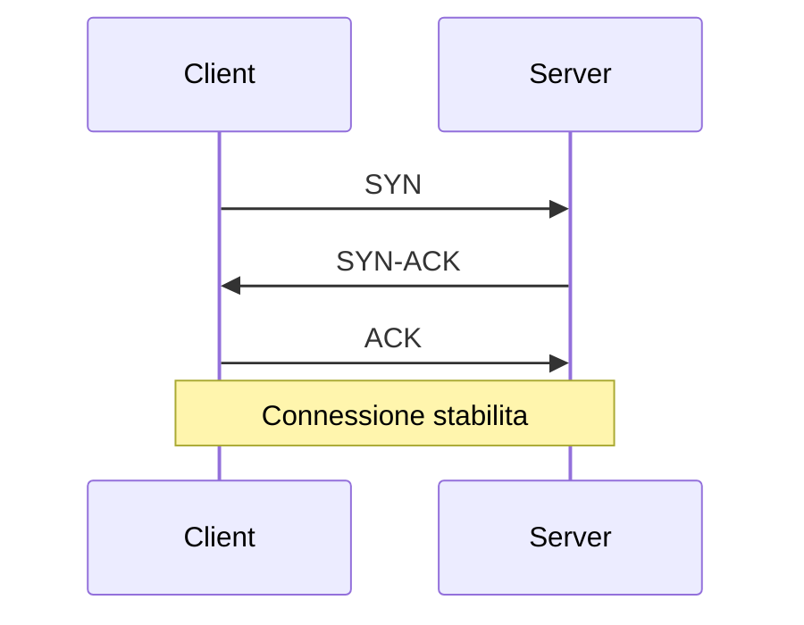

# 1. Concetti Fondamentali del Networking

## Introduzione
Il networking è la spina dorsale delle applicazioni moderne. Comprendere i concetti fondamentali è essenziale per sviluppare applicazioni robuste e scalabili che comunicano efficacemente attraverso la rete.

## Teoria

### Il Modello OSI e TCP/IP

Il **modello OSI** (Open Systems Interconnection) è un framework teorico a 7 livelli che standardizza le funzioni di comunicazione di rete:

```
7. Applicazione  - HTTP, FTP, SMTP
6. Presentazione - Crittografia, Compressione
5. Sessione      - Gestione sessioni
4. Trasporto     - TCP, UDP
3. Rete          - IP, ICMP
2. Collegamento  - Ethernet, WiFi
1. Fisico        - Cavi, Radio
```

Il **modello TCP/IP** è più pratico e si basa su 4 livelli:

```
4. Applicazione  - HTTP, FTP, SMTP, DNS
3. Trasporto     - TCP, UDP
2. Internet      - IP, ICMP, ARP
1. Accesso Rete  - Ethernet, WiFi
```

### Indirizzi IP e Porte

**Indirizzo IP**: Identificatore univoco di un dispositivo sulla rete
- **IPv4**: 192.168.1.1 (32 bit)
- **IPv6**: 2001:db8::1 (128 bit)

**Porta**: Numero che identifica un servizio specifico su un host
- Range: 0-65535
- Porte well-known (riservate): 0-1023 (HTTP:80, HTTPS:443, SSH:22)
- Porte registrate: 1024-49151
- Porte dinamiche: 49152-65535

```java
// Rappresentazione Java di un indirizzo IP
InetAddress ip = InetAddress.getByName("192.168.1.1");
```

### Il Protocollo TCP

**TCP (Transmission Control Protocol)** è un protocollo orientato alla connessione che garantisce:

✅ **Orientato alla connessione**: Handshake a 3 vie
✅ **Affidabile**: Conferma ricezione, ritrasmissione
✅ **Controllo di flusso**: Previene congestione
✅ **Ordinato**: Pacchetti in sequenza corretta

**Handshake TCP a 3 vie:**


### Il Protocollo UDP

**UDP (User Datagram Protocol)** è un protocollo senza connessione che offre:

⚡ **Velocità**: Minimo overhead  
🚫 **Nessuna garanzia**: Pacchetti possono perdersi  
🚫 **Nessun ordine**: Pacchetti possono arrivare disordinati  
📦 **Datagrammi**: Messaggi discreti  

### Quando usare TCP vs UDP

| **Usa TCP quando** | **Usa UDP quando** |
|-------------------|------------------|
| Affidabilità cruciale | Velocità prioritaria |
| Trasferimento file | Streaming video/audio |
| Navigazione web | Giochi online |
| Email | DNS queries |
| Database | IoT sensors |

## 💡 Best Practices, Tips & Tricks

- **Scegli il protocollo giusto**: Analizza sempre i requisiti dell'applicazione
- **Gestisci timeout**: Non lasciare connessioni aperte indefinitamente  
- **Monitora le performance**: Tieni traccia di latenza e throughput
- **Considera la sicurezza**: Usa sempre connessioni sicure per dati sensibili

## 🧠 Verifica dell'Apprendimento

### Domande a Scelta Multipla

1. **Quale livello del modello OSI gestisce TCP e UDP?**  
    a) Livello di Rete  
    b) Livello di Trasporto  
    c) Livello di Applicazione

2. **Quale caratteristica NON è garantita da UDP?**  
    a) Velocità di trasmissione  
    b) Consegna affidabile  
    c) Basso overhead

3. **Quanti passaggi ha l'handshake TCP?**  
    a) 2  
    b) 3  
    c) 4

### Risposte alle Domande
1. **Risposta corretta: b)** TCP e UDP operano al livello di Trasporto (4° livello OSI).
2. **Risposta corretta: b)** UDP non garantisce la consegna affidabile dei pacchetti.
3. **Risposta corretta: b)** L'handshake TCP prevede 3 passaggi: SYN, SYN-ACK, ACK.

### Proposte di Esercizi
- **Esercizio 1 (Facile)**: Identifica quale protocollo (TCP o UDP) useresti per un'applicazione di chat testuale e spiega perché.
- **Esercizio 2 (Intermedio)**: Analizza il traffico di rete della tua applicazione web preferita e identifica i protocolli utilizzati.
- **Esercizio 3 (Avanzato)**: Progetta un protocollo ibrido che utilizzi sia TCP che UDP per un'applicazione di videoconferenza.

## Navigazione del Corso
- [📑 Torna all'Indice del Corso](../README.md)
- [➡️ Guida Successiva](02-Introduzione-ai-Socket.md)