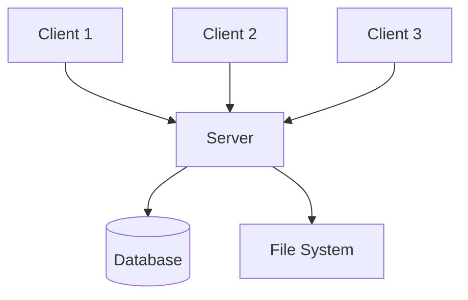
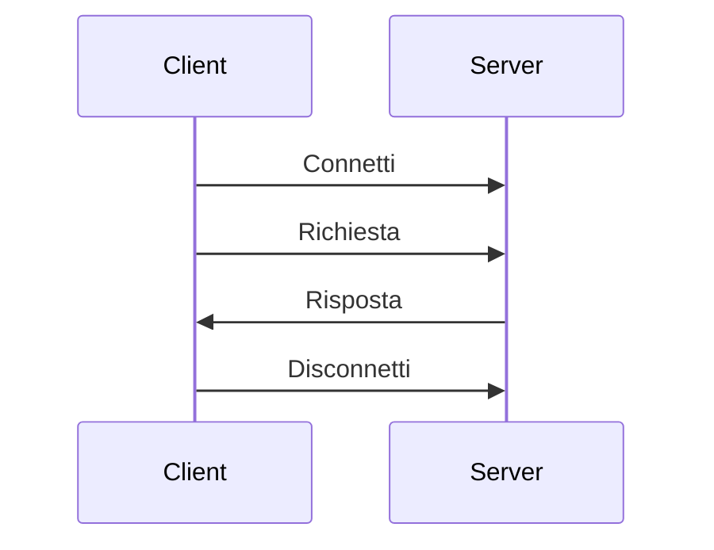
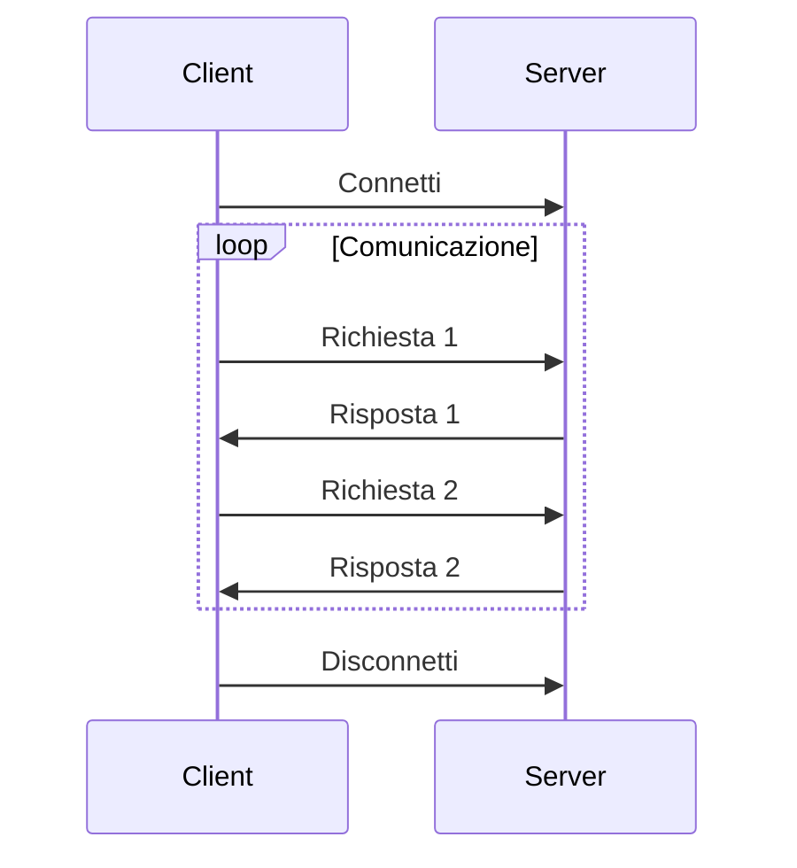

# 3. Architetture Client-Server

## Introduzione
L'architettura client-server è il paradigma fondamentale della comunicazione di rete moderna. Comprendere le diverse tipologie e i loro trade-off è essenziale per progettare applicazioni scalabili e performanti.

## Teoria

### Il Modello Client-Server

Il **modello client-server** è un'architettura distribuita dove:

**Client** 🖥️:
- Inizia la comunicazione
- Richiede servizi
- Ha un'interfaccia utente
- Può essere mobile o desktop

**Server** 🖧:
- Fornisce servizi
- Aspetta richieste
- Gestisce risorse condivise
- Sempre attivo e raggiungibile



### Server Iterativo vs Concorrente

#### Server Iterativo 🔄

**Caratteristiche**:
- Gestisce **un client alla volta**
- Semplice da implementare
- Basse risorse richieste
- ⚠️ Scalabilità limitata

**Flusso di Esecuzione**:
```java
while (true) {
    Socket client = serverSocket.accept();  // Attende client
    handleClient(client);                   // Elabora richiesta
    client.close();                         // Chiude connessione
}
```

**Quando usarlo**:
- Applicazioni semplici
- Pochi client simultanei
- Elaborazioni veloci
- Risorse limitate

#### Server Concorrente ⚡

**Caratteristiche**:
- Gestisce **più client simultaneamente**
- Maggiore complessità
- Richiede più risorse
- ✅ Scalabilità elevata

**Approcci di Implementazione**:

1. **Thread per Client**:
```java
while (true) {
    Socket client = serverSocket.accept();
    new Thread(() -> handleClient(client)).start();
}
```

2. **Thread Pool**:
```java
ExecutorService executor = Executors.newFixedThreadPool(10);
while (true) {
    Socket client = serverSocket.accept();
    executor.submit(() -> handleClient(client));
}
```

3. **Event-Driven (NIO)**:
```java
Selector selector = Selector.open();
// Gestione eventi asincroni
```

### Ciclo di Vita delle Connessioni

#### Connessioni Short-Lived 📱


**Vantaggi**: Semplice, libera risorse rapidamente  
**Svantaggi**: Overhead di connessione

#### Connessioni Long-Lived 🔗


**Vantaggi**: Minore overhead, stato mantenuto  
**Svantaggi**: Consuma risorse, gestione complessa

### Pattern Architetturali Avanzati

#### 1. Connection Pool 🏊‍♂️
```java
public class ConnectionPool {
    private final Queue<Socket> pool = new ConcurrentLinkedQueue<>();
    private final int maxConnections = 10;
    
    public Socket borrowConnection() { /* ... */ }
    public void returnConnection(Socket socket) { /* ... */ }
}
```

#### 2. Load Balancer ⚖️
- **Round Robin**: Distribuzione circolare
- **Least Connections**: Server con meno connessioni  
- **Weighted**: Basato sulla capacità del server

#### 3. Proxy Server 🔄
- **Forward Proxy**: Nasconde i client
- **Reverse Proxy**: Nasconde i server
- **Caching Proxy**: Memorizza risposte frequenti

## 🔗 Esempi di Riferimento

- [Esempio 01: Server Iterativo](./esempi/03-01_ServerIterativo.java) - Server che gestisce un client alla volta
- [Esempio 02: Server Concorrente](./esempi/03-02_ServerConcorrente.java) - Server multi-threaded
- [Esempio 03: Client Base](./esempi/03-03_ClientBase.java) - Client generico per i test

## 💡 Best Practices, Tips & Tricks

- **Progetta per la scalabilità**: Considera il carico futuro dall'inizio
- **Gestisci le risorse**: Pool di connessioni e thread
- **Implementa timeout**: Evita connessioni "zombie"
- **Monitora le performance**: CPU, memoria, connessioni attive
- **Pianifica il fail-over**: Cosa succede se il server si blocca?

⚠️ **Errori Comuni da Evitare**:
- Creare thread illimitati (OutOfMemoryError)
- Non gestire disconnessioni improvvise
- Ignorare la gestione dello stato
- Non implementare heartbeat per connessioni long-lived

## 🧠 Verifica dell'Apprendimento

### Domande a Scelta Multipla

1. **Qual è la differenza principale tra server iterativo e concorrente?**  
    a) Il server iterativo è più veloce  
    b) Il server concorrente gestisce più client simultaneamente  
    c) Il server iterativo usa meno memoria

2. **Quando è preferibile usare connessioni long-lived?**  
    a) Per applicazioni web stateless  
    b) Per chat in tempo reale  
    c) Per download di file singoli

3. **Cos'è un connection pool?**  
    a) Un database per memorizzare connessioni  
    b) Un insieme di connessioni riutilizzabili  
    c) Un tipo di server concorrente

### Risposte alle Domande
1. **Risposta corretta: b)** Il server concorrente può gestire più client contemporaneamente usando thread o eventi.
2. **Risposta corretta: b)** Le chat richiedono comunicazione bidirezionale continua, ideale per connessioni long-lived.
3. **Risposta corretta: b)** Un connection pool mantiene un insieme di connessioni pronte per il riutilizzo.

### Proposte di Esercizi
- **Esercizio 1 (Facile)**: Implementa un server eco che risponde con lo stesso messaggio ricevuto.
- **Esercizio 2 (Intermedio)**: Crea un server concorrente che mantiene una lista di client connessi.
- **Esercizio 3 (Avanzato)**: Sviluppa un sistema di chat multi-utente con rooms separate.

## Navigazione del Corso
- [📑 Torna all'Indice del Corso](../README.md)
- [⬅️ Guida Precedente](02-Introduzione-ai-Socket.md)
- [➡️ Esercitazione Successiva](04-Il-protocollo-TCP.md)