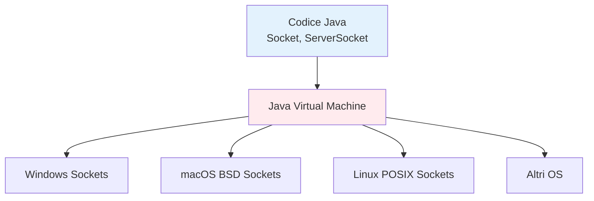

# 4. Java Networking: Indipendenza dalla Piattaforma e Funzionalità Ricche

## Introduzione
Java è stato progettato sin dall'inizio (1995) con il networking nel suo DNA. A differenza di altri linguaggi che richiedono librerie esterne o adattamenti specifici per piattaforma, Java offre un supporto nativo, robusto e **completamente indipendente dalla piattaforma** per lo sviluppo di applicazioni di rete. 🌐

## 🎯 La Filosofia "Write Once, Run Anywhere"

### Il Design Originale
```java
// Lo stesso codice Java funziona identicamente su:
// - Windows
// - macOS  
// - Linux
// - Unix
// - E qualsiasi altra piattaforma con JVM

Socket socket = new Socket("example.com", 80);
// Nessuna modifica necessaria per OS diversi!
```

### Confronto con Altri Linguaggi
| Linguaggio | Dipendenze Piattaforma | Librerie Networking |
|------------|------------------------|---------------------|
| **Java** | ❌ Nessuna | ✅ Native nel JDK |
| C/C++ | ✅ Alta (POSIX/WinAPI) | ❌ Librerie esterne |
| Python | ⚠️ Minima (ma dipendenze) | ✅ Standard library |
| C# | ✅ Windows-centric | ✅ .NET Framework |
| Rust | ⚠️ Minima (ma dipendenze) | ❌ Librerie esterne |

### Componenti di Networking Integrati in Java
```java
// TCP Networking
Socket clientSocket = new Socket(host, port);
ServerSocket serverSocket = new ServerSocket(port);

// UDP Networking  
DatagramSocket udpSocket = new DatagramSocket();
DatagramPacket packet = new DatagramPacket(data, length);

// URL Handling
URL url = new URL("http://example.com");
URLConnection connection = url.openConnection();

// Indirizzi di Rete
InetAddress address = InetAddress.getByName("google.com");
```

## 🌍 Indipendenza dalla Piattaforma: Come Funziona?

### La JVM come Astrazione


### Gestione Automatica delle Differenze di OS

#### Differenze Astratte:
- **Separatori di percorso**: Java usa `/` sempre (JVM converte automaticamente)
- **Encoding dei caratteri**: Gestione uniforme con Unicode
- **Byte order**: Network byte order automatico
- **Gestione errori**: Eccezioni invece di codici OS-specifici

## 🚀 Funzionalità Avanzate Built-in

### 1. Gestione Automatica dei Protocolli
```java
// Java gestisce automaticamente:
// - Handshake TCP
// - Conversione endianness
// - Timeout e ritry
// - Buffer management

Socket socket = new Socket();
socket.connect(new InetSocketAddress(host, port), 5000); // Timeout automatico
```

### 2. Supporto Multithreading Integrato
```java
// Server multithreaded con poche righe di codice
try (ServerSocket server = new ServerSocket(8080)) {
    while (true) {
        Socket client = server.accept();
        new Thread(() -> handleClient(client)).start();
    }
}
```

### 3. Gestione Sicurezza e Permessi
```java
// Security Manager integrato
SecurityManager manager = System.getSecurityManager();
if (manager != null) {
    manager.checkConnect(host, port); // Controllo permessi
}
```

### 4. Supporto per Protocolli Applicativi
```java
// HTTP Client integrato (dalle versioni più recenti)
HttpClient client = HttpClient.newHttpClient();
HttpRequest request = HttpRequest.newBuilder()
    .uri(URI.create("https://api.example.com"))
    .build();

HttpResponse<String> response = client.send(request, 
    HttpResponse.BodyHandlers.ofString());
```

## 💡 Esempi di Indipendenza dalla Piattaforma

## 🛡️ Vantaggi dell'Approccio Java

### 1. **Zero Dipendenze Esterne**
```java
// Tutto nel JDK - nessun download aggiuntivo
import java.net.*;     // Socket, URL, HTTP
import java.nio.*;     // Canali ad alte prestazioni
import java.security.*; // Crittografia e sicurezza
```

### 2. **Manutenibilità e Leggibilità**
```java
// Codice chiaro e auto-documentante
URL url = new URL("https://api.service.com/data");
URLConnection conn = url.openConnection();

// vs codice C equivalente molto più verboso
```

### 3. **Gestione Errori Robusta**
```java
try {
    Socket socket = new Socket(host, port);
    // Gestione automatica degli errori di rete
} catch (UnknownHostException e) {
    System.err.println("Host sconosciuto: " + e.getMessage());
} catch (ConnectException e) {
    System.err.println("Connessione rifiutata: " + e.getMessage());
} catch (IOException e) {
    System.err.println("Errore I/O: " + e.getMessage());
}
```

### 4. **Performance Competitive**
```java
// Con NIO, Java compete con le performance del C++
Selector selector = Selector.open();
ServerSocketChannel serverChannel = ServerSocketChannel.open();
serverChannel.configureBlocking(false);
serverChannel.register(selector, SelectionKey.OP_ACCEPT);
```

## 🔧 Best Practices per Networking Java

### 1. Usa Try-with-Resources
```java
// Gestione automatica della chiusura
try (Socket socket = new Socket(host, port);
     OutputStream out = socket.getOutputStream();
     InputStream in = socket.getInputStream()) {
    
    // Lavora con gli stream
    out.write(data);
    
} // Chiusura automatica garantita
```

### 2. Gestisci gli Timeout
```java
Socket socket = new Socket();
socket.setSoTimeout(3000); // Timeout di 3 secondi
socket.connect(new InetSocketAddress(host, port), 5000);
```

### 3. Usa ExecutorService per Connessioni Multiple
```java
ExecutorService threadPool = Executors.newFixedThreadPool(10);
try (ServerSocket server = new ServerSocket(8080)) {
    while (true) {
        Socket client = server.accept();
        threadPool.submit(() -> handleClient(client));
    }
}
```

## 📊 Confronto Pratico: Java vs Altri Linguaggi

### Sviluppo di un Server Echo
**Java (15 righe):**
```java
try (ServerSocket server = new ServerSocket(8080)) {
    Socket client = server.accept();
    InputStream in = client.getInputStream();
    OutputStream out = client.getOutputStream();
    in.transferTo(out); // Echo automatico
}
```

**C POSIX (40+ righe):**
```c
// Codice verbose con gestione manuale errori
int server_fd = socket(AF_INET, SOCK_STREAM, 0);
// ... bind, listen, accept, read, write, close manuali
```

**Python (simile a Java ma dipendenze interpreter):**
```python
import socket
with socket.socket() as s:
    s.bind(('localhost', 8080))
    s.listen()
    client, addr = s.accept()
    # Gestione manuale dei dati
```

## 🎯 Perché Scegliere Java per il Networking?

### Scenari Ideali per Java:
- ✅ **Applicazioni Enterprise**
- ✅ **Microservizi e Cloud**
- ✅ **Prototipazione Rapida**  
- ✅ **Team con Competenze Eterogenee**
- ✅ **Deploy Multi-Piattaforma**
- ✅ **Manutenibilità a Lungo Termine**

### Quando Considerare Alternative:
- ⚠️ **Embedded Systems con Risorse Limitate**
- ⚠️ **Performance Estreme Real-Time**
- ⚠️ **Controllo Hardware Diretto**

## 🔮 Il Futuro: Java nel Moderno Networking

### HTTP/2 Client (Java 11+)
```java
HttpClient client = HttpClient.newBuilder()
    .version(HTTP_2)
    .build();

HttpRequest request = HttpRequest.newBuilder()
    .uri(URI.create("https://http2.golang.org"))
    .build();

// Supporto moderno per protocolli recenti
```

### WebSocket API (Java EE/Jakarta EE)
```java
@ServerEndpoint("/chat")
public class ChatEndpoint {
    @OnOpen
    public void onOpen(Session session) {
        // Gestione connessioni WebSocket
    }
}
```

## 💎 Conclusioni

Java rimane una scelta eccellente per lo sviluppo di applicazioni di rete grazie a:

1. **🌐 Indipendenza completa dalla piattaforma**
2. **📚 Ricche funzionalità built-in**  
3. **⚡ Performance competitive** con NIO
4. **🛡️ Sicurezza e robustezza** integrate
5. **👥 Vasta community** e ecosystem

```java
// Il sogno "Write Once, Run Anywhere" è realtà
// nel mondo del networking Java!
System.out.println("Java: il linguaggio di networking cross-platform per eccellenza! 🚀");
```
---

*"Java non ha solo reso il networking accessibile - lo ha reso elegante e portabile."* - James Gosling

---

## Navigazione del Corso
- [📑 Torna all'Indice del Corso](../README.md)
- [⬅️ Guida Precedente](03-Architetture-Client-Server.md)
- [➡️ Esercitazione Successiva](../02-Ambiente-Sviluppo/README.md)

---

*Corso "Socket Programming in Java" - ITIS Cannizzaro"*  
*Versione 1.0 - Ottobre 2025*